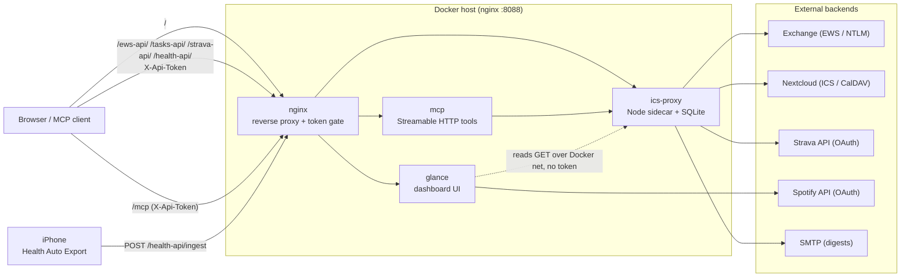

# Glance Dashboard

Personal dashboard built with [Glance](https://github.com/glanceapp/glance),
served via nginx with a custom `ics-proxy` sidecar and an MCP server. The proxy
doubles as an assistant backend: a single source of truth for the user's calendar
and tasks that an MCP client (Claude Code, Claude Desktop) can read and write. It
also sends a daily email digest. See `CLAUDE.md` (operational runbook) and
`mcp.md` (MCP details).

## Pages

- **Home**: clock, Nextcloud calendar, weather, bookmarks, Spotify, server stats, to-do
- **Work**: clock, Exchange calendar (EWS), weather, work bookmarks, Pomodoro, Arbeitstag, Spotify, work to-do
- **Strava**: 30-activity summary, year-to-date goals, HR zones, training load (ACWR), interactive charts (HR / Relative Effort / distance), zone distribution, recent activities
- **Health**: Apple Health summary (sleep, resting HR, HRV, steps, energy, nutrition) plus daily trend charts, fed by Health Auto Export

## Architecture



- **glance**: dashboard UI (glanceapp/glance). Widgets read the proxy's GET
  endpoints directly over the Docker network, bypassing nginx, so they never need
  the token. The Spotify widget calls the Spotify API client-side.
- **nginx**: reverse proxy and token gate. Routes `/ews-api/`, `/tasks-api/`,
  `/strava-api/`, `/health-api/` to ics-proxy and `/mcp` to the MCP server. GET on
  the API paths and all of `/mcp` require an `X-Api-Token`; POSTs are token-checked
  by ics-proxy itself (`/health-api/ingest` is passed through for the phone).
- **ics-proxy**: Node.js sidecar. Reads Exchange events (EWS/NTLM), Nextcloud
  events and tasks (ICS/CalDAV), Strava (OAuth), and ingests Apple Health; persists
  Strava + Health history in SQLite (`./data`); writes calendar/tasks via
  token-protected POSTs; sends daily and weekly email digests.
- **mcp**: remote MCP server (stateless Streamable HTTP) exposing the proxy as
  named tools at `/mcp`. See `mcp.md`.

## Features

**Reads** (`GET`, token-gated externally): upcoming Exchange events, upcoming
Nextcloud events, open home/work tasks, a merged `agenda` (work + home, any day or
window, including past), `free-slots` (open time in working hours), and `search`
across events and tasks. Recurring Nextcloud events (`RRULE`) are expanded, so
repeating entries appear on every occurrence (honoring `EXDATE` and per-occurrence
overrides).

**Strava** (`GET`, read-only, token-gated externally): recent activities, athlete
profile, gear, HR/power zones, per-activity performance and time-series streams,
and clubs. The proxy holds a Strava OAuth refresh token and mints short-lived
access tokens on demand (same pattern as Spotify). Reads are cached generously to
stay inside Strava's rate limits (100 reads / 15 min). Surfaced both as a Home
dashboard widget and as MCP tools. Read-only: no write tools exist.

**Writes** (`POST`, token-protected):

- Tasks: create, complete, rename, delete, and set start/due date (home and
  work). Dates can be all-day (`YYYY-MM-DD`) or a specific time (ISO datetime),
  and a `duration` (minutes) with a timed start makes a timed block.
- Nextcloud (home) events: create, reschedule, update (location/title/time),
  delete.
- Exchange (work) meetings: create (sends invites if attendees are set),
  delete/cancel, and reschedule to a new time (with a recurring-series guard).

Exchange events can be created and deleted/cancelled (a single recurring
occurrence deletes only that instance; a series master is refused unless
explicitly allowed). Moving an Exchange event to a new time is supported; editing other fields (title/location) is not yet. All home-calendar and task operations are full
CRUD over CalDAV.

**Directory lookup** (`GET`, token-gated): `resolve-attendees` searches the
Exchange global address list and contacts (EWS `ResolveNames`) and returns
matches with email first, plus name, department, office, business phone and
mobile. Usable both to resolve a meeting attendee and as a general colleague /
employee lookup (MCP tools `search_attendees` and `search_directory`).

**Email digests**: `ics-proxy` emails a styled agenda via SMTP, a daily one each
morning (today's work + home events with join links/locations, plus open tasks)
and an optional weekly overview every Monday (the whole week grouped by day).
Configured by env, flagged high importance, scheduled with cron.

## Setup

### 1. Clone and configure

```bash
git clone https://github.com/j551n-ncloud/glance-public.git
cd glance-public
```

### 2. Create `.env`

```bash
cp .env.example .env
```

Then fill in the values:

| Variable | Description |
|---|---|
| `ICS_URL` | Nextcloud public calendar ICS URL (read-only) |
| `CAL_URL` | Writable Nextcloud CalDAV collection for creating/editing events |
| `ICS_USER` / `ICS_PASS` | Nextcloud credentials |
| `EWS_URL` | Exchange EWS endpoint |
| `EWS_USER` / `EWS_PASS` / `EWS_DOMAIN` | Exchange/NTLM credentials |
| `TASKS_HOME_URL` | Nextcloud CalDAV URL for home task list |
| `TASKS_WORK_URL` | Nextcloud CalDAV URL for work task list |
| `SPOTIFY_BTOA` | `base64("client_id:client_secret")` |
| `SPOTIFY_REFRESH` | Spotify OAuth2 refresh token |
| `STRAVA_CLIENT_ID` / `STRAVA_CLIENT_SECRET` | Strava API app credentials (read-only; optional) |
| `STRAVA_REFRESH_TOKEN` | Strava OAuth refresh token, scope `read,activity:read_all,profile:read_all` |
| `GLANCE_SECRET_KEY` | Glance session secret |
| `GLANCE_PASSWORD_HASH` | Bcrypt hash of Glance login password |
| `NEXTCLOUD_BTOA` | `base64("user:password")` for task creation |
| `API_TOKEN` | Shared secret for the token-protected API and MCP (`X-Api-Token`) |

Daily digest (optional, disabled unless `DIGEST_ENABLED=true`):

| Variable | Description |
|---|---|
| `DIGEST_ENABLED` | `true` to enable the daily email (default `false`) |
| `DIGEST_TO` | recipient address |
| `DIGEST_CRON` | cron expression (default `0 8 * * *`) |
| `DIGEST_TZ` | timezone (default `Europe/Berlin`) |
| `DIGEST_PRIORITY` | email importance: `high` / `normal` / `low` (default `high`) |
| `SMTP_HOST` / `SMTP_PORT` | SMTP server (port default `465`) |
| `SMTP_SECURE` | implicit TLS (default `true`) |
| `SMTP_USER` / `SMTP_PASS` | SMTP credentials |
| `SMTP_FROM` | From header (defaults to `SMTP_USER`) |
| `WEEKLY_DIGEST_ENABLED` | `true` to enable the weekly Monday overview email |
| `WEEKLY_DIGEST_TO` | recipient (defaults to `DIGEST_TO`) |
| `WEEKLY_DIGEST_CRON` | cron expression (default `0 8 * * 1`, Mondays) |

### 3. Start

```bash
docker compose up -d --build
```

Dashboard available at `http://localhost:8088`. Four containers come up: `nginx`,
`glance`, `ics-proxy`, `mcp`.

## Nextcloud Tasks setup

1. Open Nextcloud Tasks → create two lists named `home-tasks` and `work-tasks`.
2. The CalDAV URLs follow the pattern:
   ```
   https://<nextcloud>/remote.php/dav/calendars/<user>/<list-name>/?export
   ```

## Refresh tokens (Spotify and Strava)

Both integrations use the same OAuth pattern: a one-time browser authorization
yields a long-lived **refresh token**, which goes in `.env`. At runtime,
short-lived access tokens are minted from it automatically (the Spotify widget
does this client-side on each load, the proxy does it server-side for Strava),
so you never have to repeat the browser step unless you revoke access.

### Spotify setup (optional)

The Spotify widget needs a refresh token with playback scopes:

1. Create an app at https://developer.spotify.com/dashboard. Add
   `http://127.0.0.1:8888/callback` as a **Redirect URI**. Note the Client ID
   and Client Secret.
2. Authorize once in a browser, substituting your client id:
   ```
   https://accounts.spotify.com/authorize?client_id=<CLIENT_ID>&response_type=code&redirect_uri=http://127.0.0.1:8888/callback&scope=user-read-playback-state%20user-modify-playback-state
   ```
   The redirect to `http://127.0.0.1:8888/callback?code=XXXX` shows a browser
   error (nothing runs there); copy the `code` from the address bar. The code
   expires after a few minutes, so do step 3 right away.
3. Exchange the code for a refresh token:
   ```bash
   curl -s -X POST https://accounts.spotify.com/api/token \
     -H "Authorization: Basic $(printf '%s' '<CLIENT_ID>:<CLIENT_SECRET>' | base64)" \
     -d grant_type=authorization_code -d code=<CODE> \
     -d redirect_uri=http://127.0.0.1:8888/callback | jq -r .refresh_token
   ```
4. Fill in `.env`:
   ```bash
   SPOTIFY_BTOA=$(printf '%s' '<CLIENT_ID>:<CLIENT_SECRET>' | base64)
   SPOTIFY_REFRESH=<refresh token from step 3>
   ```
5. Restart Glance: `docker compose up -d --build glance`.

Spotify refresh tokens do not rotate on use; they stay valid until you revoke
the app under https://www.spotify.com/account/apps/.

### Strava setup (optional, read-only)

One-time OAuth to obtain a refresh token with the activity scope:

1. Create an API application at https://www.strava.com/settings/api. Set
   **Authorization Callback Domain** to `localhost`. Note the Client ID and
   Client Secret. (The access/refresh tokens shown on that page only carry the
   `read` scope and cannot list activities, so the browser step below is
   required.)
2. Authorize once in a browser, substituting your client id:
   ```
   https://www.strava.com/oauth/authorize?client_id=<CLIENT_ID>&redirect_uri=http://localhost&response_type=code&approval_prompt=force&scope=read,activity:read_all,profile:read_all
   ```
   The redirect to `http://localhost/?...&code=XXXX&...` shows a browser error
   (nothing runs there); copy the `code` from the address bar.
3. Exchange the code for a refresh token:
   ```bash
   curl -s -X POST https://www.strava.com/oauth/token \
     -d client_id=<CLIENT_ID> -d client_secret=<CLIENT_SECRET> \
     -d grant_type=authorization_code -d code=<CODE> | jq .refresh_token
   ```
4. Put `STRAVA_CLIENT_ID`, `STRAVA_CLIENT_SECRET`, and that
   `STRAVA_REFRESH_TOKEN` in `.env`, then
   `docker compose up -d --build ics-proxy mcp` (and
   `--force-recreate nginx` if the `/strava-api/` route is new).

The proxy refreshes access tokens automatically. If Strava ever rotates the
refresh token, ics-proxy logs the new value (`Strava rotated the refresh
token...`); update `.env` with it. (This differs from Spotify, whose refresh
tokens never rotate.)

## API & MCP access

The proxy API and MCP server are token-protected with `X-Api-Token` (value =
`API_TOKEN`):

- GET on the API paths and all of `/mcp` are denied (`403`) without the token.
- POSTs are checked by ics-proxy (`401` without the token).
- `uid` parameters are validated against `[A-Za-z0-9._@-]+` to prevent CalDAV
  path traversal.

A single shared `API_TOKEN` grants full read/write, so keep it (and `.env`)
private and serve `/mcp` over HTTPS in production.

- **Operational guide for using it as an assistant backend:** `CLAUDE.md`
- **MCP server (tools, registration, remote):** `mcp.md`

The MCP server is reachable locally at `http://localhost:8088/mcp` and remotely at
`https://dash.example.com/mcp`. It exposes 30 tools. Calendar, tasks and directory (20):
`list_events`, `list_ics_events`, `list_tasks`, `create_task`, `complete_task`,
`rename_task`, `create_event`, `create_meeting`, `delete_meeting`, `reschedule_meeting`, `search_attendees`,
`search_directory`, `get_agenda`, `find_free_slots`, `search`, `delete_event`,
`reschedule_event`, `update_event`, `delete_task`, `set_task_dates`.
Strava, read-only (10): `list_strava_activities`,
`get_strava_athlete`, `get_strava_zones`, `get_strava_gear`,
`get_strava_activity`, `get_strava_streams`, `get_strava_clubs`,
`get_strava_ytd`, `get_strava_load`, `get_strava_series`.

### Registering the MCP in Claude Code

Both commands resolve the token from `.env` so it is not typed in plaintext.

Local (project scope, written to `.mcp.json`; needs the local stack running):

```bash
claude mcp add --transport http --scope project glance http://localhost:8088/mcp \
  --header "X-Api-Token: $(grep '^API_TOKEN=' .env | cut -d= -f2- | tr -d '"'\'')"
```

Remote (user scope, works from any directory and network):

```bash
claude mcp add --transport http --scope user glance-remote https://dash.example.com/mcp \
  --header "X-Api-Token: $(grep '^API_TOKEN=' .env | cut -d= -f2- | tr -d '"'\'')"
```

A new Claude Code session picks the server up (approve the project server when
prompted). Verify with `claude mcp list`. For Claude Desktop (via the
`mcp-remote` bridge) see `mcp.md`.

## Updating

```bash
git pull origin main
docker compose up -d --build
docker compose up -d --force-recreate nginx   # re-render the nginx template + re-resolve upstreams
```
